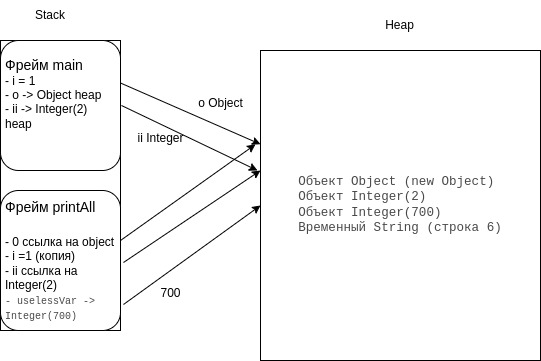

## Понимание JVM

Код для исследования

```java
public class JvmComprehension {

    public static void main(String[] args) {
        int i = 1;                      // 1
        Object o = new Object();        // 2
        Integer ii = 2;                 // 3
        printAll(o, i, ii);             // 4
        System.out.println("finished"); // 7
    }

    private static void printAll(Object o, int i, Integer ii) {
        Integer uselessVar = 700;                   // 5
        System.out.println(o.toString() + i + ii);  // 6
    }
}

```



* В стек попадают 2 фрейма, 
1) Main
2) printAll

В каждом из них сохраняются переменные, к примеру `int i =1` так как примитив, и ссылки на место в куче. Так же эти ссылки передаются во второй фрейм printAll.

Перед выполнением кода выполняется загрузка и поиск всех необходимых классов:
1) Bootstrap ClassLoader загружает основные классы Java (например, java.lang.Object, java.lang.System)
2) Platform ClassLoader загружает остальные классы платформы, кстати есть очень развернутый ответ какие классы загружает данный этап [link](https://stackoverflow.com/questions/76699669/which-exact-classes-are-loaded-by-platform-classloader) и другие из этого списка.
3) Application ClassLoader загружает класс JvmComprehension.

В конце перед 7 строкой из фрейма будет удален printAll, объект uselessVar становится недостижимым. 

После этого его может удалить Garbage Collection.

После завершения программы, main() удаляется из стека. Объекты Object Integer(2) останутся в кучи, но программа завершается и JVM освободит всю выделенную память.